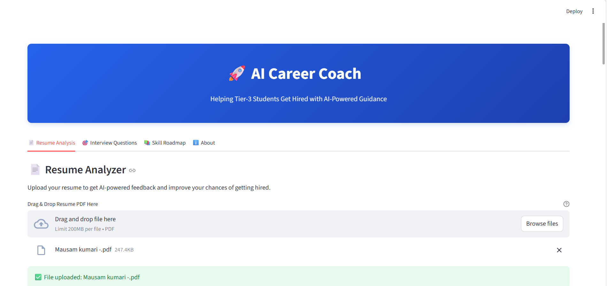
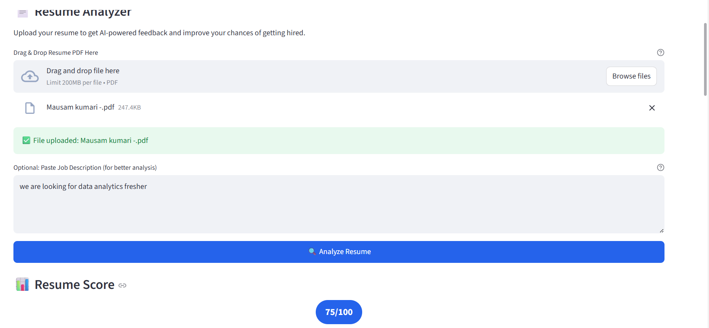
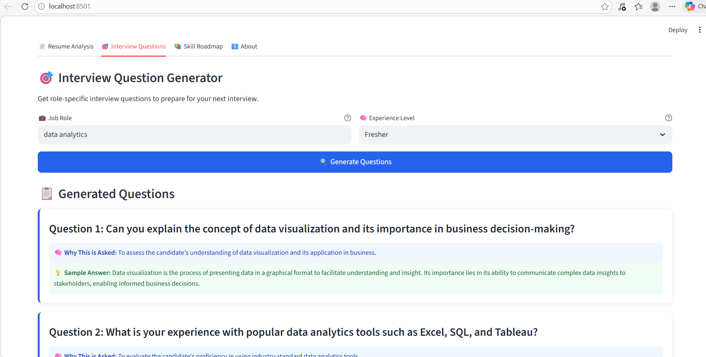
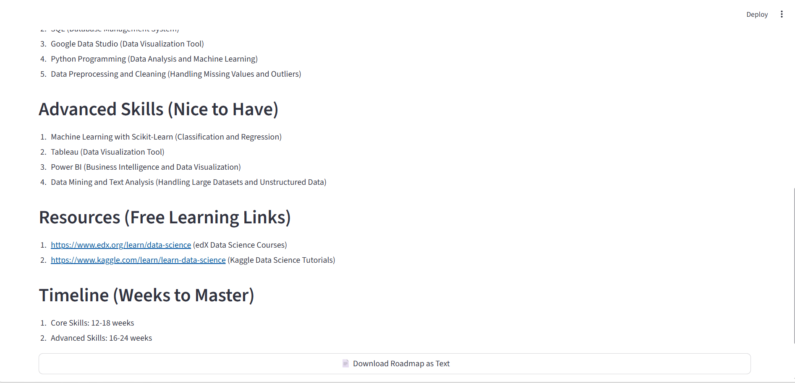

# 🚀 AI Career Coach – Helping Tier-3 Students Get Hired

An AI-powered web application that helps students improve their resumes, prepare for interviews, and build a structured skill roadmap tailored for the Indian job market.

---

## 🎯 Features

### 📄 Resume Analysis
- ATS-based resume scoring
- Missing keyword detection
- STAR method improvement suggestions
- Strength & weakness analysis

### 🎯 Interview Question Generator
- Role-specific interview questions
- Technical + Behavioral questions
- Why each question is asked
- Sample answer structure

### 📚 Skill Roadmap Generator
- Core skills to master
- Advanced skills
- Free learning resources
- Structured learning timeline
- Download roadmap skills

---

## 🛠 Tech Stack

- **Backend:** FastAPI
- **Frontend:** Streamlit
- **LLM:** Groq (Llama 3.1)
- **Language:** Python
- **Deployment Ready**

---

## 📸 Application Screenshots

### 🏠 Home Page

### 📄 Resume Analysis

### 🎯 Interview Generator

### 📚 Skill Roadmap

---

